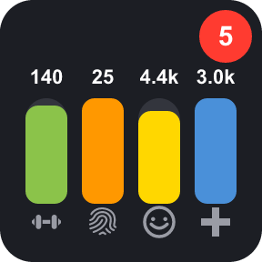
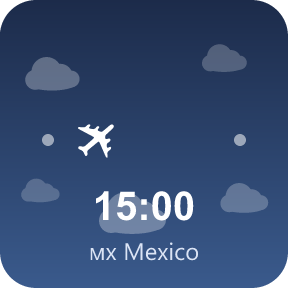
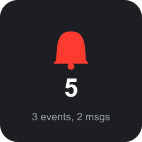
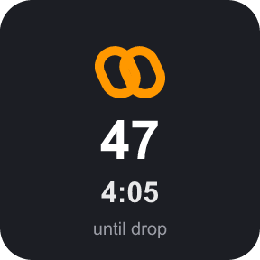
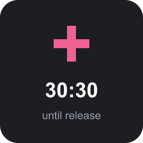
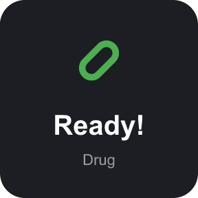
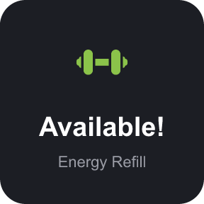
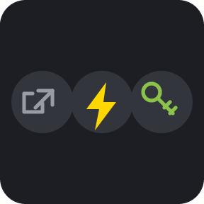

# TornDeck

A Stream Deck plugin that puts live [Torn](https://www.torn.com) data on your deck — stats, flight tracking, chain and hospital countdowns, cooldowns, refills, and notifications, all synced to Torn's own server clock.

> **Unofficial fan-made tool.** Not affiliated with, endorsed by, or associated with Torn.com in any way. Uses the public Torn API with a key you provide yourself.

## Features

| | |
|---|---|
|  |  |
| **Stats Indicator** — live Energy/Nerve/Happy/Life bars with real Torn icons, optional current/max numbers, and a notification badge. Flashes when a bar hits its normal cap (won't flash if you've stacked past it, e.g. for a ranked war). | **Flight Status** — a plane flying through the clouds along your route, with a live countdown. Shows the destination flag, and switches to an "Abroad" card once you've landed and are staying put. |
|  |  |
| **Notifications** — unread event/message/award/competition count, flashing until dismissed. | **Chain** — live hit count and countdown, flashing once it's close to dropping (threshold you set). |
|  |  |
| **Hospital** — live release countdown, flashing once you're close (threshold you set). | **Cooldowns** — drug/booster/medical countdown (pick which one per key), flashing once ready. |
|  |  |
| **Refills** — shows whether today's free energy/nerve refill has been used, flashing while it's still available. | **Every key** — long-press to open a URL (defaults to torn.com, or point it anywhere), a flash-for-alerts on/off toggle, and one shared API key entered once (masked like a password field) for every action. |

## Setup

1. Get a Torn API key at [torn.com/preferences.php#tab=api](https://www.torn.com/preferences.php#tab=api) (minimal access is enough for everything here).
2. Install the plugin — grab the `.streamDeckPlugin` file from [Releases](https://github.com/C4LLZ/torndeck/releases) and double-click it (Stream Deck will install it), or build from source below.
3. Drag any TornDeck action onto a key and paste your API key into its settings — it's shared automatically with every other TornDeck key.

## Building from source

```bash
cd torndeck
npm install
npm run build
```

This compiles `src/` into `com.callz.torndeck.sdPlugin/bin/plugin.js`. Useful commands from the [Elgato CLI](https://www.npmjs.com/package/@elgato/cli):

```bash
npx streamdeck validate com.callz.torndeck.sdPlugin   # check the manifest
npx streamdeck restart com.callz.torndeck              # reload into a running Stream Deck app
npx streamdeck pack com.callz.torndeck.sdPlugin        # produce a distributable .streamDeckPlugin
```

## How it's built

- Each key renders its own SVG on the fly based on live Torn API data — no static images for the "live" states.
- A shared request cache dedupes overlapping API calls (e.g. Stats, Notifications, and Chain all pull from the same `bars,notifications` call) so adding more keys doesn't multiply your request volume.
- Countdown timers tick locally every second between syncs, corrected against Torn's own server clock (not just the local machine's) so they stay accurate.
- All alerts share one "blink until acknowledged" pattern: flash starts when something needs attention, stops the moment you press the key, and re-arms automatically once the underlying condition changes again.

## License

[MIT](LICENSE)
