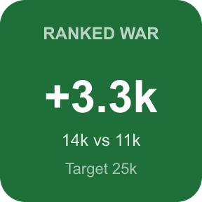
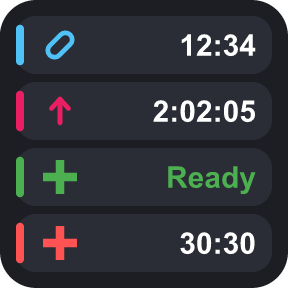
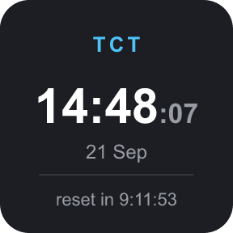

# TornDeck

A Stream Deck plugin that puts live [Torn](https://www.torn.com) data on your deck — stats, flight and status tracking, chain and hospital countdowns, cooldowns, refills, ranked war lead, a TCT clock, and notifications, all synced to Torn's own server clock.

> **Unofficial fan-made tool.** Not affiliated with, endorsed by, or associated with Torn.com in any way. Uses the public Torn API with a key you provide yourself.

## Features

| | |
|---|---|
|  |  |
| **Stats Indicator** — live Energy/Nerve/Happy/Life bars with real Torn icons, optional current/max numbers, and a notification badge. Flashes when a bar hits its normal cap (won't flash if you've stacked past it, e.g. for a ranked war). | **Flight Status** — a plane flying through the clouds along your route, with a live countdown. Shows the destination flag, and switches to an "Abroad" card once you've landed and are staying put. |
|  |  |
| **Status** — one key for whatever you're currently doing: flying (plane, countdown, destination flag), hospital (countdown, plus a faded flag and the country name if you're hospitalised abroad), jail, abroad, or okay. Optionally shows the current TCT time along the top. Flashes when hospital/jail is nearly over (threshold you set) and when you land. | **War** — your faction's ranked war lead: green background when you're winning, red when you're losing, with both scores and the war target (or a countdown until it starts). Uses one extra faction API request every 30s, only while a War key is on your deck. |
|  |  |
| **Notifications** — unread event/message/award/competition count, flashing until dismissed. | **Chain** — live hit count and countdown, flashing once it's close to dropping (threshold you set). |
|  |  |
| **Hospital** — live release countdown, flashing once you're close (threshold you set). | **Cooldowns** — drug/booster/medical countdown, one per key, or switch a key to **Combined** to show several as colour-coded rows at once (drug, booster, medical, and optionally hospital — you pick which rows). Flashes when a cooldown finishes. |
|  |  |
| **Refills** — shows whether today's free energy/nerve refill has been used, flashing while it's still available. | **TCT Clock** — Torn City Time (UTC) with the date and a countdown to the daily reset. Needs no API key and makes no API requests. |

Every key also supports:
- **Long-press to open a URL** — defaults to torn.com, or point it at any page you want.
- **A "flash for alerts" toggle** — turn off the blinking entirely and just get the steady visual (where the key flashes).
- **One shared API key** — enter it once (masked like a password field), every key uses it.

The Status key also has an optional **Show time above status** setting that adds a small TCT time along the top of the key.

## Setup

1. Get a Torn API key at [torn.com/preferences.php#tab=api](https://www.torn.com/preferences.php#tab=api) (minimal access is enough for everything here).
2. Install the plugin — grab the `.streamDeckPlugin` file from [Releases](https://github.com/C4LLZ/torndeck/releases) and double-click it (Stream Deck will install it), or build from source below.
3. Drag any TornDeck action onto a key and paste your API key into its settings — it's shared automatically with every other TornDeck key.

## Building from source

```bash
cd torndeck
npm install
npm run build
```

This compiles `src/` into `com.callz.torndeck.sdPlugin/bin/plugin.js`. Useful commands from the [Elgato CLI](https://www.npmjs.com/package/@elgato/cli):

```bash
npx streamdeck validate com.callz.torndeck.sdPlugin   # check the manifest
npx streamdeck restart com.callz.torndeck              # reload into a running Stream Deck app
npx streamdeck pack com.callz.torndeck.sdPlugin        # produce a distributable .streamDeckPlugin
```

## How it's built

- Each key renders its own SVG on the fly based on live Torn API data — no static images for the "live" states.
- A shared request cache dedupes overlapping API calls (every user-data key pulls from one combined `bars,notifications,cooldowns,refills,basic,travel` call, cached for 20s) so adding more keys doesn't multiply your request volume. The War key is the only exception, since faction data lives on a separate endpoint.
- Countdown timers tick locally every second between syncs, corrected against Torn's own server clock (not just the local machine's) so they stay accurate.
- All alerts share one "blink until acknowledged" pattern: flash starts when something needs attention, stops the moment you press the key, and re-arms automatically once the underlying condition changes again.

## License

[MIT](LICENSE)
